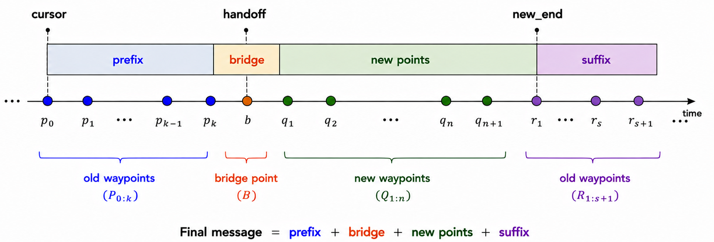
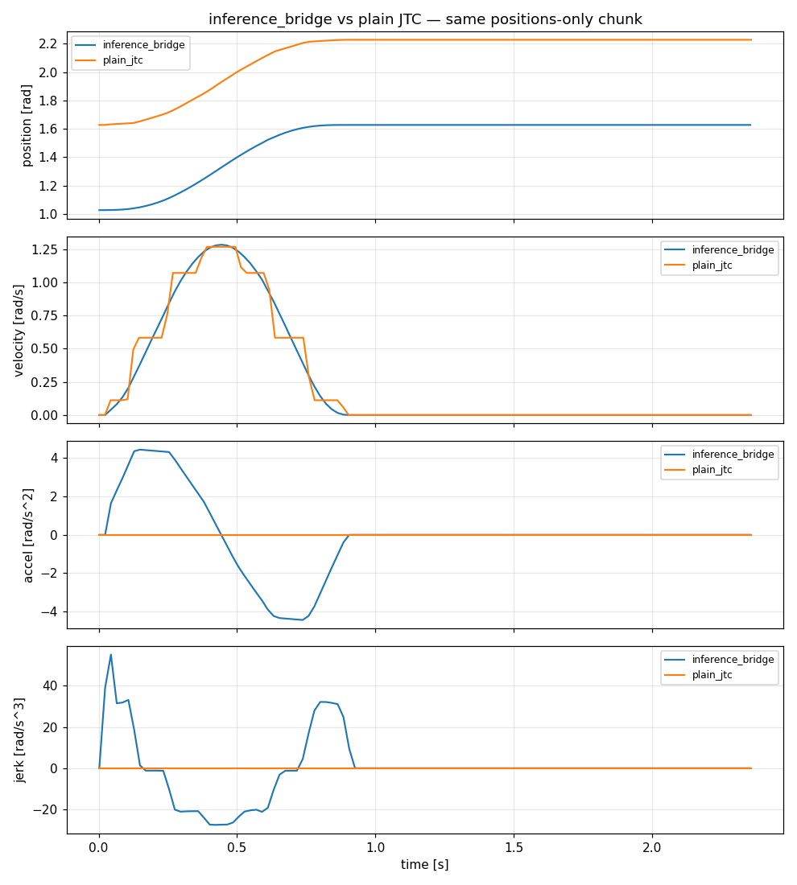
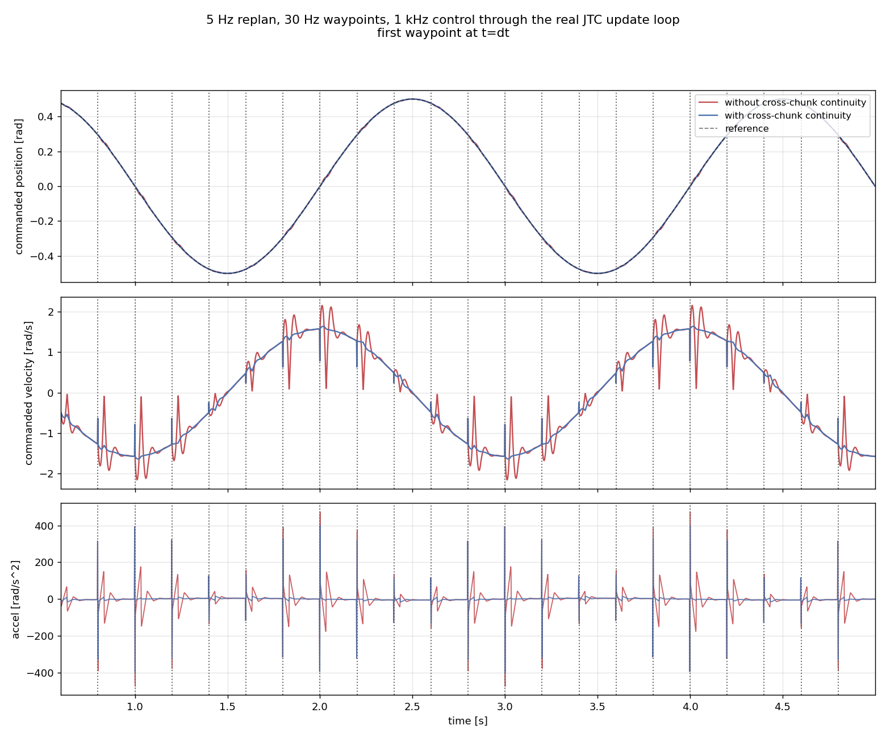
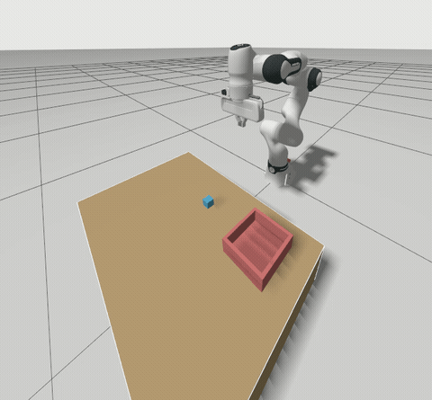
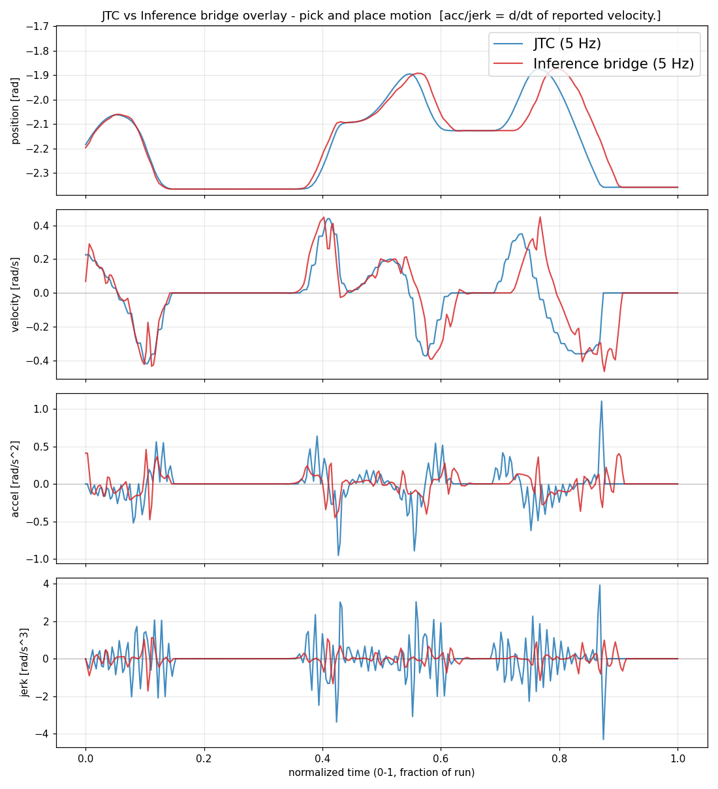
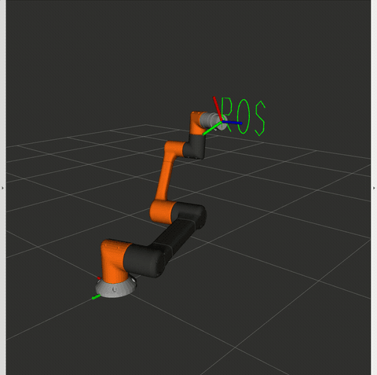
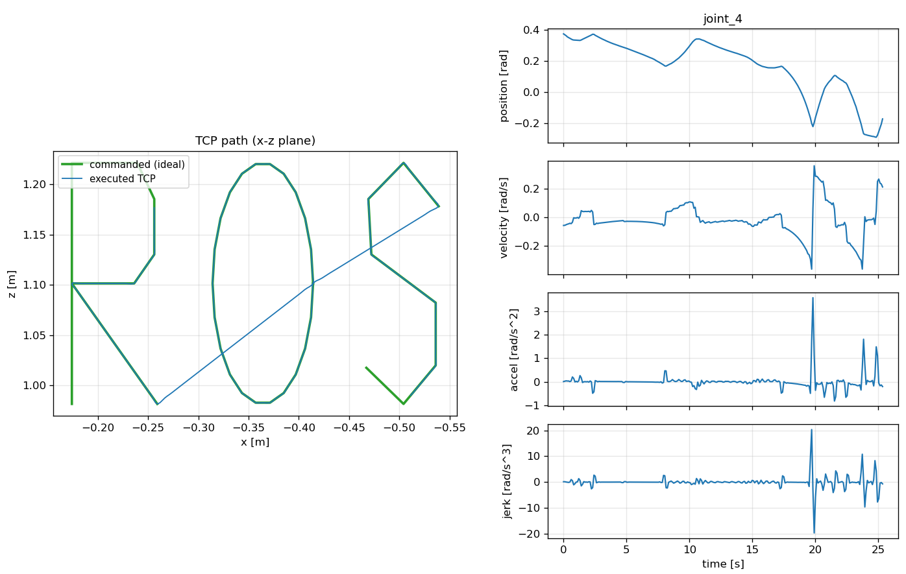

# 
Physical AI Inference and Trajectory Upscaling for ros2_control

&nbsp;&nbsp;&nbsp;&nbsp;

#### 
 [Open Source Robotics Foundation](https://www.openrobotics.org/) | [Google Summer of Code 2026](https://summerofcode.withgoogle.com/)

#### 
 Project: Physical AI Inference and Trajectory Upscaling for ros2_control

#### 
 Contributor: [Vedhas Talnikar](https://github.com/vedh1234)

#### 
 Mentors: [Sai Kishor Kothakota](https://github.com/saikishor), [Bence Magyar](https://github.com/bmagyar)

#### 
 Repositories: [ros2_controllers](https://github.com/ros-controls/ros2_controllers), [ros2_control](https://github.com/ros-controls/ros2_control), [ros2_control_demos](https://github.com/ros-controls/ros2_control_demos)

---

## Problem and Motivation

Action-chunk policies (VLAs, diffusion policies, ACT) emit joint targets at roughly 20 to 50 Hz and
replan every 50 to 500 ms; the hardware underneath expects a fresh command every control cycle, at
500 Hz to 2 kHz. Forwarding sparse waypoints as they arrive puts a velocity discontinuity and an
acceleration spike at every waypoint, which is the command shape a drive's fault detection is built
to reject.

`joint_trajectory_controller` (JTC) assumes a motion planner supplies a complete trajectory, with
derivatives and with enough time to finish before the next one arrives. A policy supplies neither.
Three gaps followed, one per section below:

- **Trajectory replacement was destructive.** A future-stamped trajectory killed the active one the
  moment it arrived, discarding the path the robot was still meant to be following and replacing it
  with a slow spline ramp to the new first point. Joints the new message omitted froze instead of
  completing their motion. Tracked as issue
  [#84](https://github.com/ros-controls/ros2_controllers/issues/84), open since August 2020, and was not ported from ROS 1. *Merged.*
- **Positions-only messages fell back to linear interpolation.** JTC picks its interpolation degree
  from the fields present in the message, so positions alone give straight lines between waypoints,
  a staircase velocity and an impulse acceleration at every knot. *In review.*
- **No Cartesian trajectory controller existed.** Joint-space interpolation does not move the tool
  along a straight line, and several policy families (diffusion policies, OpenVLA, RT-2) emit
  end-effector poses rather than joint angles. *In review.*

Two end-to-end demos in `ros2_control_demos` and three supporting upstream fixes came out of the
same work.

---

## 1. Trajectory replacement with blending

Merged as [ros2_controllers#2419](https://github.com/ros-controls/ros2_controllers/pull/2419).

On arrival of a new message, the controller assembles one merged trajectory in place rather than
swapping trajectories:

The prefix, bridge and suffix all come from the old trajectory; only the new points are the
client's message.

- **Cursor** is the playback position on the old trajectory, not wall-clock time, so the merge is
  correct under speed scaling.
- **Prefix** holds the robot on the previously planned path until the handoff instant, preserving
  any obstacle avoidance already planned into it.
- **Bridge** point is sampled analytically from the old spline, so the seam carries real velocity
  and acceleration instead of zeros.
- **Suffix** lets joints omitted from the new message finish their original motion instead of
  freezing. This is the ROS 1 behaviour issue #84 asked for.

Implementation notes:

- New members: `blend_with_active_trajectory()`, `fill_omitted_joints_from_old()`, `blend_sample_`
  (pre-allocated, no RT allocation), `blend_commanded_`, `blend_prefix_size_`.
- The merged trajectory is re-anchored to the cursor with `header.stamp = Time(0)`. Anchoring at the
  old trajectory's start instead causes a forward position jump under speed scaling, because JTC
  resets its time base on the first sample of a new trajectory.
- Action feedback `index` is offset by `blend_prefix_size_`, so clients see their own waypoint
  numbering rather than indices shifted by the prepended prefix.
- Parameter `allow_trajectory_replacement`, default `true`. Set `false` for the previous
  hard-replace behaviour.
- 10 new tests, plus `test_execute_partial_traj_in_future`, previously disabled in the repository
  and the stated done-criterion for issue #84.

---

## 2. Positions-only action chunks in JTC

Open as [ros2_controllers#2491](https://github.com/ros-controls/ros2_controllers/pull/2491), with
cross-chunk continuity following as
[vedh1234/ros2_controllers#4](https://github.com/vedh1234/ros2_controllers/pull/4), stacked on it.

<table>
<tr>
<td width="43%"></td>
<td width="57%"></td>
</tr>
<tr>
<td align="center"><em>Figure 1. One chunk: plain JTC vs upsampling</em></td>
<td align="center"><em>Figure 2. A stream of chunks: with and without cross-chunk continuity</em></td>
</tr>
</table>

Rather than adding an interpolator, the controller solves for the knot velocities a global cubic
spline would have, writes them into the message, and lets JTC's existing cubic Hermite sampling
reproduce the spline. Each interior knot contributes one row requiring the acceleration approaching
it to equal the acceleration leaving it, and the two boundary rows fix the velocity at the first and
last knot. That is a tridiagonal system per joint, solved in O(n) by the Thomas algorithm in
`fill_cubic_spline_velocities()` (`trajectory.cpp`), called from the non-real-time subscription
callback.

Cross-chunk continuity (#4) replaces the original rest boundary conditions, which forced `v = 0` at
both ends of every chunk and so planned a stop at every seam; without it the commanded velocity
rings around the reference by over 0.5 rad/s (figure 2). The start is now clamped to the last
commanded velocity, using the thread-safe snapshot added in #2564. The end stays at rest, so a
policy that stops publishing leaves the robot stationary.

- On a single chunk, plain JTC gives the stepped velocity trace and reports acceleration and jerk as
  identically zero, since linear interpolation has no curvature to report; upsampling gives smooth
  velocity and a real acceleration (figure 1).
- On a policy pick-and-place at 5 Hz, positions follow nearly the same trajectory while jerk peaks
  drop by roughly a factor of four and most high-frequency content between waypoints is removed
  (figure 3).
- **No change to the real-time path.** What reaches `update()` is an ordinary velocity-carrying
  trajectory, so tolerances, speed scaling and action goals continue to work unmodified.
- Messages already carrying velocities pass through untouched. The feature is a strict superset of
  current behaviour and is off by default.
- Parameters: `positions_upsampling.enable`, `positions_upsampling.policy_frequency`. The latter
  synthesizes `time_from_start` for chunks that arrive as a bare position array with no timing.
- 17 tests across `test_trajectory.cpp` and `test_trajectory_controller_upsampling.cpp`.

<table>
<tr>
<td width="54%"></td>
<td width="46%"></td>
</tr>
<tr>
<td align="center"><em>Figure 3. Pick and place under a learned policy at 5 Hz</em></td>
<td align="center"><em>Jerk on the same motion, plain JTC vs upsampling</em></td>
</tr>
</table>

---

## 3. Cartesian trajectory controller

Open as [vedh1234/ros2_controllers#3](https://github.com/vedh1234/ros2_controllers/pull/3), also
stacked on #2491. Related to
[issue #2435](https://github.com/ros-controls/ros2_controllers/issues/2435).

<table>
<tr>
<td width="41%"></td>
<td width="59%"></td>
</tr>
<tr>
<td align="center"><em>Figure 4. Tool centre point tracing "ROS" on a 6-DOF arm</em></td>
<td align="center"><em>Commanded path (green) vs executed TCP (blue)</em></td>
</tr>
</table>

A new package subclassing JTC rather than replacing it.

- **Input:** `trajectory_msgs/MultiDOFJointTrajectory` on `~/cartesian_reference`. A single pose is
  the N=1 case of a chunk, so there is one code path.
- **Path interpolation:** cubic Hermite for translation, SLERP for rotation, with shortest-arc
  quaternion alignment. Rotation follows the geodesic, avoiding the gimbal artifacts of RPY-Euler
  interpolation.
- **Timing:** synthesized from `max_cartesian_speed` (default 0.1 m/s) and `max_angular_speed`
  (default 0.5 rad/s) when the chunk carries none, so segment duration is distance-aware.
- **IK:** differential (Jacobian) IK via `kinematics_interface`, run at every `resample_dt` (default
  0.01 s) sample. Output is an ordinary joint trajectory handed to the base class.
- **Joint velocity fill:** each waypoint carries `delta_q / dt`, the resolved-rate joint velocity
  already computed by the IK step. Without it the dense 100 Hz knots put JTC back on its linear
  branch, reintroducing the staircase from section 2 one layer down.
- **Frame handling:** `frame_id` must equal `kinematics.base` or the message is rejected. No TF
  dependency.
- The executed tool path holds the commanded geometry across the whole letter sequence (figure 4);
  the diagonal segments there are transits between letters, where nothing was commanded.
- 23 tests across the controller, the trajectory class and plugin loading.

---

## Demos

Both on mock hardware, so they run without a robot.

- **[example_19](https://github.com/ros-controls/ros2_control_demos/pull/1159)**: mock VLA policy
  streams positions-only chunks to a 2-DOF RRBot. `verify_smoothness.py` reports C1/C2 continuity
  and seam metrics for single, sequential and overlapping chunks.
- **[example_20](https://github.com/ros-controls/ros2_control_demos/pull/1185)**: mock Cartesian
  policy drives a 6-DOF arm through circles, squares and lines. `verify_cartesian_tracking.py` runs
  five scenarios reporting pass or fail, including straight-line deviation under 5 mm and a count of
  joint-limit violations.

---

## Contributions

| PR | Repository | Status |
|---|---|---|
| [#2419](https://github.com/ros-controls/ros2_controllers/pull/2419) Trajectory replacement with full blending at message arrival | ros2_controllers | Merged |
| [#2564](https://github.com/ros-controls/ros2_controllers/pull/2564) Thread-safe snapshot of last commanded state | ros2_controllers | Merged |
| [#2422](https://github.com/ros-controls/ros2_controllers/pull/2422) Deliver abort action result before destroying goal handle on preemption | ros2_controllers | Merged |
| [#2401](https://github.com/ros-controls/ros2_controllers/pull/2401) Trajectory blending with new trajectory deferral | ros2_controllers | Merged, superseded by #2419 |
| [#3196](https://github.com/ros-controls/ros2_control/pull/3196) Make configure_controller lifecycle transition strict | ros2_control | Merged |
| [#2491](https://github.com/ros-controls/ros2_controllers/pull/2491) positions_upsampling for positions-only trajectories | ros2_controllers | Open, in review |
| [#4](https://github.com/vedh1234/ros2_controllers/pull/4) Cross-chunk continuity for positions upsampling | ros2_controllers (fork) | Open, stacked on #2491 |
| [#3](https://github.com/vedh1234/ros2_controllers/pull/3) Cartesian trajectory controller | ros2_controllers (fork) | Open, stacked on #2491 |
| [#1159](https://github.com/ros-controls/ros2_control_demos/pull/1159) Example 19, action-chunk upsampling demo | ros2_control_demos | Open, in review |
| [#1185](https://github.com/ros-controls/ros2_control_demos/pull/1185) Example 20, Cartesian controller demo | ros2_control_demos | Open, in review |
| [#2443](https://github.com/ros-controls/ros2_controllers/pull/2443) Standalone InferenceBridgeController | ros2_controllers | Closed, folded into #2491 |

The two fork PRs are stacked on the branch of #2491 to keep their diffs readable. Both move upstream
once #2491 lands.

---

## Design decisions

| Where | Decision | Alternative | Reason |
|---|---|---|---|
| Trajectory replacement, [#2419](https://github.com/ros-controls/ros2_controllers/pull/2419) | Merge at arrival | Defer the new trajectory until its stamp | Deferral leaves `active_goal` and `current_trajectory_` mismatched for the whole wait: tolerance checks suppressed, no client feedback, orphaned pending trajectory if the active one aborts.|
| Action-chunk support, [#2491](https://github.com/ros-controls/ros2_controllers/pull/2491) | Feature inside JTC | Separate controller inheriting from JTC | Auditing what the standalone controller needed that JTC lacked produced one item, a global spline over positions. Tolerances, timeouts, hold-on-timeout and hardware writes already existed. 860 lines became roughly 90, and any positions-only trajectory benefits, not only policy output. |
| Spline integration, [#2491](https://github.com/ros-controls/ros2_controllers/pull/2491) | Solve knot velocities, reuse JTC sampling | Add a new `interpolation_method` | Keeps the real-time path byte-identical and leaves every existing JTC feature working. |
| Chunk boundaries, [#4](https://github.com/vedh1234/ros2_controllers/pull/4) | Clamp chunk start velocity, leave end at rest | Rest at both ends, or carry velocity at both | Removes the stop planned at every seam while keeping fail-safe behaviour if the policy stops publishing. |
| Cartesian path, [#3](https://github.com/vedh1234/ros2_controllers/pull/3) | Interpolate, then IK | IK the sparse input, then interpolate joints | IK-first bends the Cartesian path off the straight line. |
| Cartesian timing budget, [#3](https://github.com/vedh1234/ros2_controllers/pull/3) | IK in the subscription callback | IK per real-time cycle | Kinematics runs once per message off the RT thread. A 10 s path at 100 Hz on a 7-DOF arm costs about 7 ms to ingest; the RT loop stays as fast as plain JTC. |
| Cartesian joint output, [#3](https://github.com/vedh1234/ros2_controllers/pull/3) | Velocity fill from `delta_q / dt` | Second Jacobian solve on the analytic twist | The value is already computed, a second solve doubles per-step kinematics, and a fresh `J⁻¹ẋ` disagrees with the integrated positions by the damping and tracking residual, which lets the cubic overshoot between knots. |

---

## Current state and what is left

Trajectory blending is merged and released. `positions_upsampling` is functionally complete and in
review, and both cross-chunk continuity and the Cartesian controller are blocked on it landing
before they can be opened upstream. Of the three, the Cartesian controller is the most likely to
change shape in review, since it is a new package rather than an addition to an existing one.

Known gaps, all recorded in the PRs:

- **No joint-limit enforcement in the Cartesian controller.** The demo verifier counts violations,
  so the gap is visible rather than silent.
  [#3](https://github.com/vedh1234/ros2_controllers/pull/3)
- **Differential IK only**, which is all `kinematics_interface` exposes. No redundancy resolution,
  no analytic solution near singularities.
  [#3](https://github.com/vedh1234/ros2_controllers/pull/3)
- **Omitted joints lose ROS 1's spline fidelity.** ROS 1 held one trajectory per joint; ROS 2's is
  monolithic, so omitted joints are re-sampled onto the new time grid and can deviate when its
  waypoints are sparse.
  [#2419](https://github.com/ros-controls/ros2_controllers/pull/2419)
- **Two cosmetic action-feedback issues when blending**, in the reported waypoint index and
  timestamp. Commanded motion is unaffected.
  [#2419](https://github.com/ros-controls/ros2_controllers/pull/2419)

---

## Future work

- Factor the spline machinery into `control_toolbox` so JTC, the Cartesian controller and future
  controllers share one implementation rather than each carrying its own.
- IKFast plugin for `kinematics_interface`, giving an analytic constant-time backend selectable by
  parameter.
- `FollowCartesianTrajectory` action server, so Cartesian goals get the goal lifecycle, feedback and
  tolerance handling that joint-space goals already have.
- Tool-frame relative commands (`command_type: absolute | tool_delta`), resolved to base-frame poses
  during non-RT ingestion.
- Joint-limit handling in the Cartesian path.
- Single-point streaming ingestion for single-step policies, as the N=1 case of chunk ingestion.

---

## Reading material

[Design documents](https://drive.google.com/drive/u/0/folders/1xI1t85kyrz7SPEhrgykc0YREK2ujV5vy) written during the project, covering the alternatives considered and the analysis
behind the decisions above.

- [Trajectory blending](https://docs.google.com/document/d/1gsG_fPWPe0wE8y-x2eiyseT2LO-WUEoVjrjExsZfnrI/edit?tab=t.0):
  the ROS 1 comparison, the deferral and merge-at-arrival architectures.
- [Inference bridge and Cartesian controller architectures](https://docs.google.com/document/d/1-zoJmMwG6RJFYKxaaenlQjFfewpGb9_rkY8rFBbkzbE/edit?tab=t.0#heading=h.6q127uvbrtzw):
  the action-space survey across policy families, the JTC inheritance feasibility audit, the spline
  method comparison, and the Cartesian control study against AIC, CRISP and issue #2435.
- [Spinoff ideas](https://docs.google.com/document/d/1pwIeKBbK0psOBsYPCz8ptdvFYKlFri0opK-qlxrDw9I/edit?tab=t.0):
  the follow-on projects in the future work section, written up with requirements and priorities.

---

## Acknowledgements

Thanks to Sai Kishor Kothakota, Bence Magyar, and Christoph Fröhlich for guidance and review across the programme. Thanks to the Open Source Robotics Foundation for hosting the project and to the ros2_control maintainers who reviewed these changes. More broadly, thanks to the open source robotics community, whose code, issues and design discussions this work builds on throughout.
